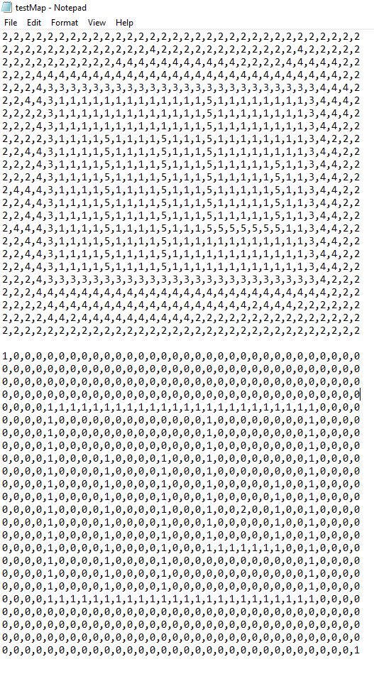
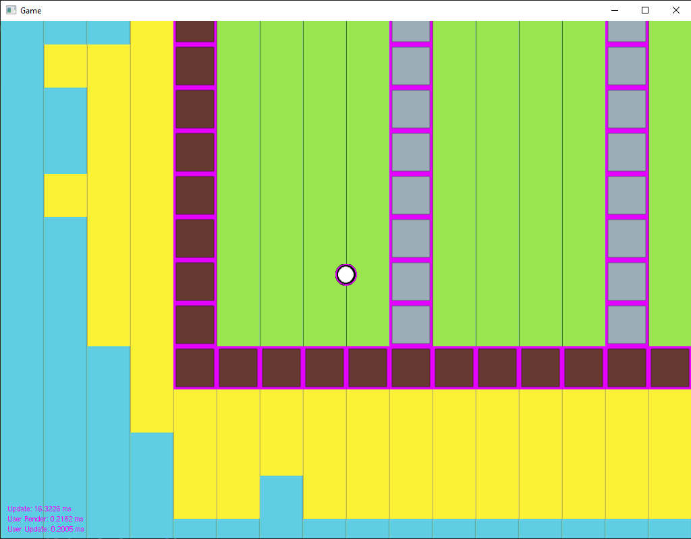

# Ubisoft NEXT 2024-2025

## Thoughts
I handed this in late...
I spent probably the last month really learning as much as I could to be able to atleast submit something I was happy with. But I'm not too upset about it. I learned plenty of interesting things that I do believe will be useful and in my opinion I made something I was happy with.

Why did I not hand it in on time? So it was last hour I just finished the bare minimum of what I wanted to get done and I was really excited to get some feedback on it and maybe even win. I decided to delete the many files I ended up scrapping to clean things up. Oh boy this was a mistake, Visual Studio kept looking for these files and wouldn't let me build the solution. I then proceeded to spend the next 45 minutes trying to get it to work so I could at least submit that. Nothing worked before there was no time and I just had to submit the broken version.
- If anyone else has this issue in the future I ended up fixing after the deadline by creating a new Visual Studio Project using a fresh download of the API provided, now it's not as simple as copying and pasting all the folders. At least I had to recreate all the files in Visual Studio (I had lots) and then copy and paste all the code into them one by one (very tedious). It also sucks since I lose my whole commit history :(. If there is a better way please shoot me a message.

## Minigolf Simulator
The theme for this competition was mini-golf, so I made a very simple game where you shoot the ball with your mouse and get it into the hole to load the next level. Now it seems ok, not many features, but I think the biggest feature is how the levels are created. If people are interested I could post a video on YouTube showing how I do it, but basically I can create a tilemap using any software (I used Aseprite) which I then export it as a txt (I used some script I found to do this with Aseprite). The txt was just the corresponding color pallet numbers displayed in rows and columns see picture. The first block was the actual map design and 2 block was where the colliders would be. I also export the colour pallet to make this work. After I have the txt and colour pallet my code just reads those files and draws them to screen for my game, and with the help of some other code I wrote it should be (last I check) scalable to any size to give an ultra zoomed in or zoomed out look. I also made collision boxes visible.

If you watch my video I still have the colliders showing and wasd (my debugging movement commands) are still active since if my late submission is taken, I want to show them what I had, since getting extra time is cheating.

Here is a link to my [YouTube](https://youtu.be/ZszyCPjoXh8) video quickly showing the game. Please don't mind the montages I made in the past hahaha.

## Learning

*Due to being busy with school I started preparing starting around December 20th. Here are the resources I used and ideas I had during this prep time.*  
### 1. Learning C++ Basics
- I used codecademy [Learn C++ Free](https://www.codecademy.com/catalog/language/c-plus-plus?g_network=g&g_productchannel=&g_adid=528849219289&g_locinterest=&g_keyword=codecademy%20c%2B%2B&g_acctid=243-039-7011&g_adtype=&g_keywordid=kwd-297912888473&g_ifcreative=&g_campaign=account&g_locphysical=1002287&g_adgroupid=128133970268&g_productid=&g_source={sourceid}&g_merchantid=&g_placement=&g_partition=&g_campaignid=1726903838&g_ifproduct=&utm_id=t_kwd-297912888473:ag_128133970268:cp_1726903838:n_g:d_c&utm_source=google&utm_medium=paid-search&utm_term=codecademy%20c%2B%2B&utm_campaign=INTL_Brand_Exact&utm_content=528849219289&g_adtype=search&g_acctid=243-039-7011&gad_source=1&gclid=Cj0KCQiAhbi8BhDIARIsAJLOlueY6S5x3A8XzjdlWOIaZRgV5eNAMfqqlqS66MmOVC5ON9lkX0m9HOoaAkuJEALw_wcB)
- I also referenced sites like W3Schools and GeeksForGeeks for more specific things since I alredy had some programming knowledge

### 2. ECS
- I had a friend who recommended to look into this as it would help, I have a rough ECS in the actual game more like EC since I didn't really have systems implemented
- At first this did not help me at all I spent alot of time trying to learn and create one without even realizing what makes them good, because of this I decided to just try and make a game and if I need one I'll add it. I also probably did not need one for this competition but having one made working in the code alot nicer, and made many things easier
- Here are the things I looked at early on [Entity Component System | Game Engine series](https://www.youtube.com/watch?v=Z-CILn2w9K0&t=235s), [Entity Component System](https://www.youtube.com/playlist?list=PLUUXnYtS5hcVFwd4Z794vA-HsoF2OIWlR), [How to make a simple entity-component-system in C++](https://www.david-colson.com/2020/02/09/making-a-simple-ecs.html), [A Simple Entity Component System (ECS) [C++]](https://austinmorlan.com/posts/entity_component_system/), [Entity Component System FAQ](https://github.com/SanderMertens/ecs-faq?tab=readme-ov-file#how-to-create-a-hierarchy-in-ecs)
    - Most of these I just read however the 2nd link I actually did follow but that didn't get me anywhere...

### 3. Physics Engine
- So at this point I started following some tutorial with the idea if he uses any methods from external libraries I'll just create them myself. Here's the video I was trying to follow [Make a C++ game FULL COURSE!](https://www.youtube.com/watch?v=XOs2qynEmNE&t=1336s), although about 13 minutes in I just started doing my own things and started making my own demo game. The first thing I needed to implement myself was a robust Vector class.
- Me being new to C++ and rusty with physics I searched and found this TextBook [Game Physics Engine Development By Ian Millington](https://www.amazon.ca/Game-Physics-Engine-Development-Commercial-Grade/dp/0123819768), this does cost money and I can say it was good enough for what I needed. Now I could easily recreate what I took from that book but it was a really good starting point especially when I was newer. But my review isn't going to be the best since I only was interested up until particles, my engine implemented Vector3 (I made z=0 so I could use it for 2D) mainly and Particle class.

### 4. Game Programming Patterns
- [Game Programming Patterns By Robert Nystrom](https://gameprogrammingpatterns.com/) This is one of the things that I desperately needed in the demo game. I went rambo and was hard coding as many things as I could it felt like. Reading most of the book I learned a lot about design and game development. The main thing I implemented following this book is my input handler which uses the Command Pattern, one of the first things you learn in this book
- This has got to be one of the best books I've ever read, although maybe I couldn't implement many ideas from this book into my own work at least I'm aware of them now. Best part is this book is also free online.

### 5. Competition
- I felt like I could "make something" at this point, I started working directly off my practice game to make the minigolf idea I had. Originally it was going to be multiplayer with a betting system, I just didn't have the time to get to that so I narrowed my scope. One of the key things I wanted for this was future expansion which is why I implemented an ECS, I also wanted a way to make maps for my game quick, easy, and efficiently since I feel like the biggest area to expand in a minigolf game would be making cooler maps.
- In the process of trying to make maps and an ECS I came across this series [How To Make A Game In C++ & SDL2 From Scratch!](https://www.youtube.com/playlist?list=PLUUXnYtS5hcVFwd4Z794vA-HsoF2OIWlR). Now the series is old, incomplete, and it uses SDL2. But I found out that SDL2 is similar to the API (somewhat) and I read an SDL tutorial that made me realize how cameras actually work. Now I definitely wished I found this series sooner, it helped me alot making the mapping system and ECS, I just had to make the SDL parts with the API. This video I would say was the biggest help during the competition
- I also spent alot of time on collisions (which I didn't even implement too well) but these types of things I find theory videos more useful, for ex this is one of the videos I referenced [Building Collision Simulations: An Introduction to Computer Graphics](https://www.youtube.com/watch?v=eED4bSkYCB8&t=344s), now I won't be linking every individual video I used, I just spent lots of time on this one.

### Bonuses!
- I watched many indie developers on YouTube to gain inspiration
- I listened to this podcast alot since which is nice especially since I'm new to Game Dev [Game Dev Field Guide](https://gamedevfieldguide.com/about)
